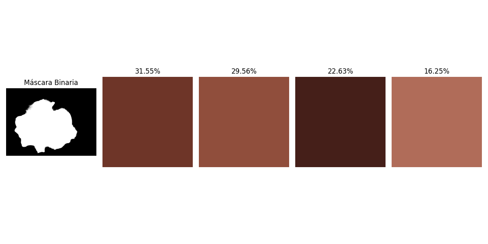

# Database Creation
Esta es una herramienta de análisis de imágenes diseñada para extraer colores dominantes de una imagen y realizar cálculos relacionados con la forma y la simetría de la máscara de la imagen. Utiliza técnicas de aprendizaje automático, como K-Means, para identificar colores y medidas de forma para proporcionar una descripción detallada de la imagen.


## Características

- **Extracción de Colores Dominantes**: Utiliza K-Means para identificar hasta 5 colores dominantes en una imagen, excluyendo el color negro.
- **Cálculo de Medidas de Forma**: Calcula el área, perímetro, diámetro, asimetría e irregularidad de la forma de la máscara.
- **Índice de Simpson**: Calcula la diversidad de los colores en la imagen.
- **Visualización**: Guarda una imagen que muestra los colores dominantes junto con la máscara binaria.
- **Exportación a CSV**: Guarda los colores y sus porcentajes junto con las medidas de forma en un archivo CSV.

## Requisitos

- Python 3.9 o superior
- Bibliotecas de Python:
  - OpenCV
  - NumPy
  - scikit-learn
  - Matplotlib
  - SciPy

Puedes instalar las bibliotecas requeridas utilizando `pip`:

```bash
pip install opencv-python numpy scikit-learn matplotlib scipy
```
Uso
- Realizas la segmentación de la imagen inicial con segmentation.py

- Preparar la imagen: Asegúrate de tener una imagen que deseas analizar. Renombra la imagen a cropped_mask.png (puedes usar la que deses) o modifica el nombre de la imagen en el código

- Ejecutar el análisis:
        Abre un terminal o consola.
        Navega al directorio donde se encuentra el archivo app.py.
        Ejecuta el script usando Python:

```bash
python app.py
```


##  Resultados:
        El programa generará un archivo PNG llamado colores_y_mascara.png que muestra los colores dominantes y la máscara binaria.
        Además, se creará un archivo CSV llamado colores_dominantes_con_porcentaje.csv (si no existe) que contendrá los colores, porcentajes, medidas de forma y otros índices.

##Personalización

    Puedes cambiar el número de colores a identificar modificando el parámetro n_clusters en la inicialización de la clase ColorAnalyzer.
    También puedes ajustar el color que se considera negro cambiando el parámetro threshold_black.

##Contribuciones

Si deseas contribuir al proyecto, siéntete libre de enviar un pull request o abrir un issue para discutir nuevas características o mejoras.
##Licencia

Este proyecto está bajo la Licencia MIT. Consulta el archivo LICENSE para obtener más información.
##Contacto

Para preguntas o comentarios, por favor contacta al autor: diego.alberto.juarez@deepaxiom.com
